# Creating a Event Hub to send events from Azure to Devo

This is not an agent, but it is a general guide on how to sent events from Azure.

The _Azure Activity Log_ and _Azure Active Directory_ logs can be easily ingested into the Devo platform by exporting the logs to an Azure event hub, which in turn triggers a cloud function to tag and send the events to Devo.

You can follow these instructions to send events from an EventHub to the Devo platform.
There are two types of events that could be sent from Azure to Devo: from Monitor (Azure activities logs) and from Active Directory (Sign-In and Audit logs).

The Azure Activity Log is a subscription log that provides insight into subscription-level events that have occurred in Azure.

Sign-ins logs provides information about the usage of managed applications and user sign-in activities.

Audit logs provides traceability through logs for all changes done by various features within Azure AD. Examples of audit logs include changes made to any resources within Azure AD like adding or removing users, apps, groups, roles and policies.

Note that only some roles can create EventHubs in Azure.
At the end of this article, there are some links that indicate who can create and access the data.


# Tables

All Azure events Azure are storage in _cloud.azure_ tech.
Then, depending on the source of the events, these are saved in custom tables.
Events that come from Azure Monitor (Azure Activity Log) are store in _cloud.azure.activity.events_ and Azure Active Directory are store in _cloud.azure.ad_.

Tag | Azure Operation Type | Description
--- | --- | ---
cloud.azure.ad.audit.\<zone> | AuditLogs | The Azure AD audit logs provide records of system activities for compliance.
cloud.azure.ad.signin.\<zone> | SignInLogs | The user sign-ins report provides records about activities of AD users.
cloud.azure.activity.events.\<zone> | Activity logs | Azure Activity logs (Action, Write, Delete)

# Structure folder of EventHubTrigger

In this repository you can find the _EventHubTrigger_ folder.
It should be similar to your eventhubtrigger folder in Azure.

In this folder you will find the following files:

- _index.js_: it is the main file that contain the logic to send events from Azure to Devo.
- _config.json_: contain the initial configuration values.
- _util.js_: contain some utilities to use in the main file. For example, send logs or stats to Devo.
- _function.json_: Azure configuration file.
- _package.json_: list of modules to install.

# Logs and stats

If you want to send customs log to Devo according to keep your records, you can use _sendLog_ and _sendStats_ functions.
In the _index.js_ file are some examples.


## Prerequisites

- Have a Azure account with the permissions
- Have a Devo account

# Create a EventHub

Go to your Azure portal account and follow the steps below.

### Creating the namespace

Click _Create a resource_ on the left side, find and select the _Event Hubs_ resource and click on the _Create_ button.


Fill the fields with the corresponding values. You may need to create a new _Resource group_ if you have not already done so.
Click on _Create_. This will take a few seconds.


Once the namespace is created, you can access it by clicking on _All resources_ on the right side of the menu and then on the namespace.


## Creating the Event Hubs

Click on the _Monitor_ option in the left side menu, then on _Activity Log_ and then on the _Export to Event Hub_ option.


Select the corresponding options with the susbcription, the namespace and the regions. Be sure to check _Export to an event hub_ option.
Then save the changes.


This may take several minutes. Once the event hub is created you can see it in the associated namespace resource.


# Creating the Function App

Click on _Create a resource_ option in left-hand menu, then search and select the _Function App_ option.
Then click on _Create_.


Fill in and select the fields corresponding your requirements. Make sure to select _JavaScript_ in the _Runtime Stack_ option.
Click on _Create_. This may take several seconds.


Once that it was created you can check it in _All resources_ option.
Select the function app and then click on _*+*_ icon in the _Functions_ option.
Choose the _In-portal_ option as the development environment, and then click on the _Continue_ button.


Choose the _More templates..._ option and then click on the _Finish and view templates_ button.


Choose the _Azure Event Hub trigger_. This could ask you to install an extension. Install it.


Fill in and select the fields according your requirements.
In the _Event Hub connection_ you must select the associated namespace.


Once the function app has been created, something like the following image should be displayed.


On the right side you can see two files and the option "Test".
In the lower part you can see the console and the generated logs.
And, on the left side, you can see the structure of the function app.

Now, you need to send the events to Devo.

First, you need to update _index.js_ file and upload the _package.json_, _config.json_ and _util.js_ files contained in this tutorial.

The _domain_name_ attribute is the name of your domain in Devo.

The _zone_ attribute correspond to one Azure region.
For more detail about region read this [article](https://azure.microsoft.com/en-us/global-infrastructure/geographies/).

For detail about _host_ and _port_ attributes read the [Devo official documentation](https://docs.devo.com/confluence/ndt/sending-data-to-devo/the-devo-in-house-relay/installing-the-devo-relay/install-on-a-virtual-machine)

_send_logs_ and _send_stats_ attributes indicate if you want to send custom logs from the FunctionApp to Devo and send the statistics of the events.

_CA_in_KV_, _Cert_in_KV_ and _Key_in_KV_ attributes indicate if the certificate file is stored in Key Vault (true) or in the Function App (false).

````json
{
    "domain_name": "my_domain",
    "zone": "West Europe",
    "host": "eu.elb.relay.logtrust.net",
    "port": 443,
    "send_logs": false,
    "send_stats": true,
    "CA_in_KV": true,
    "Cert_in_KV": true,
    "Key_in_KV": true
}
````

Install the devo js SDK and all dependencies. Inside the Azure Console run the following command:

```bash
npm install
```

This will generate a new folder (_node_modules_) with the packages.

After that, you must upload the credentials of your Devo domain according to the configuration file.
You have two options: Upload the credentials to Azure Function App or upload the credentials to Azure Key Vault.

## Upload the credentials to Azure Function App
On your computer, create a folder with the name _certs_, paste the credentials here and then compress this folder in _zip_ format. Keep in mind that you should not change the credentials files names.
Then, select the _upload_ option on the right side and select the newly created zip file.

The structure of your event hub function app should look like the following image


Unzip the _certs.zip_ file from the console.

````bash
> unzip certs.zip
````

Delete the _zip_ file.

````bash
> rm certs.zip
````


## Upload the credentials to Azure Key Vault

Go to Function App resource and click on _Platform features_ and then in _Identity_.


Activate it and click on _Save_ button.

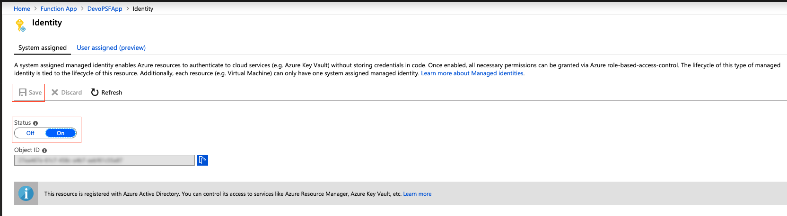

Now, click on Create a resource option in left-hand menu, then search Key Vault option. Then click on _Create_

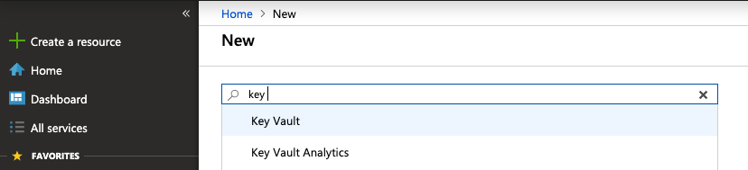

Fill in and select the fields corresponding your requirements and click on _Next : Access policy >_ button.

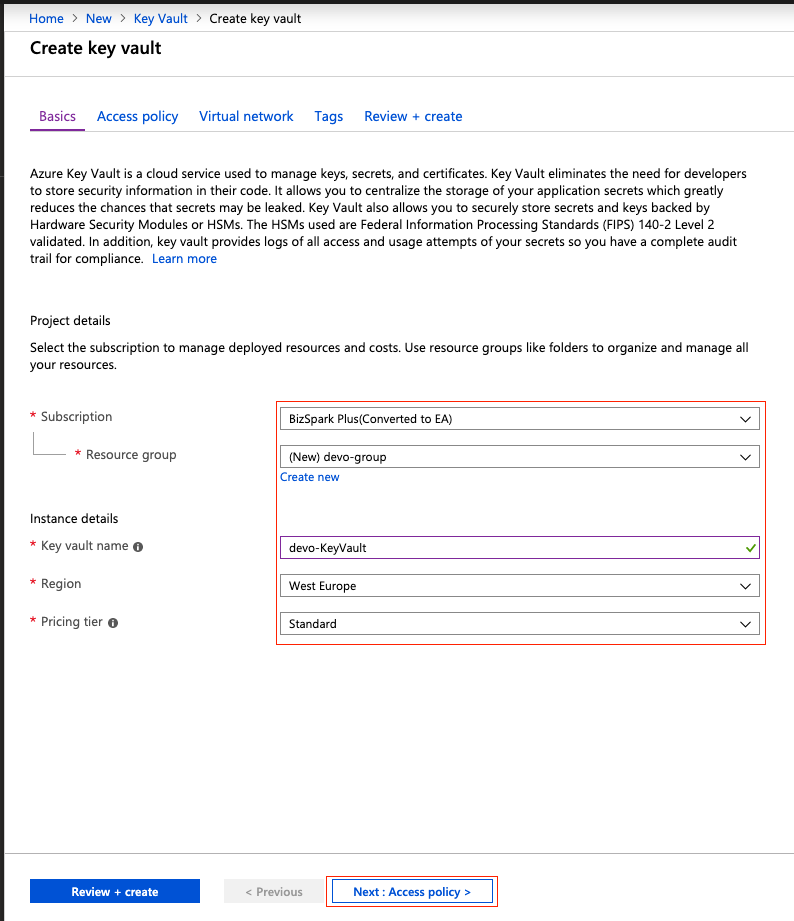

Click on _+ Add Access Policy_ option and add the permission _Get_ for _Secret permissions_ and find your Function App. Click on _select_ and _Add_ buttons.

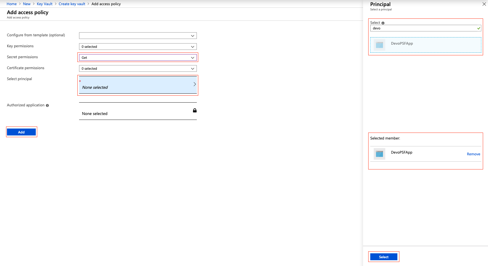

Finally, select _Review + create_ option and click on _Create_ button.

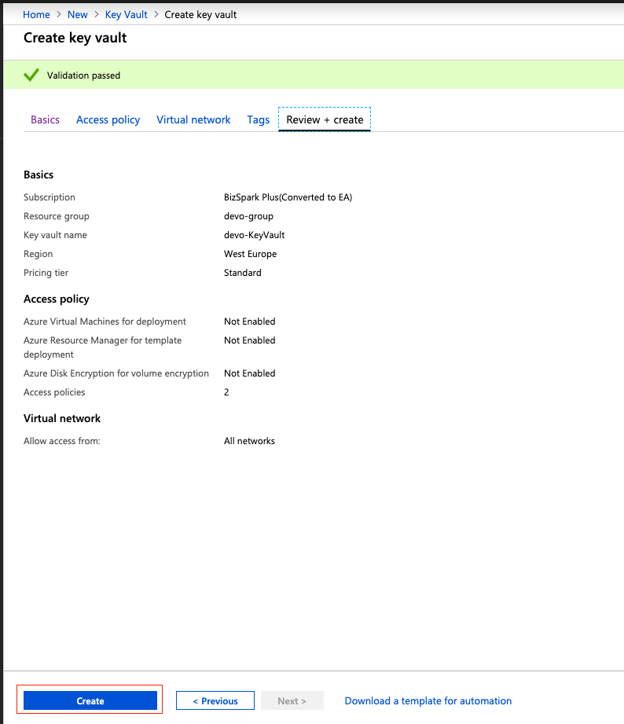

Go to the new resource and click on _Secrets_ option and then in _Generate/Import_

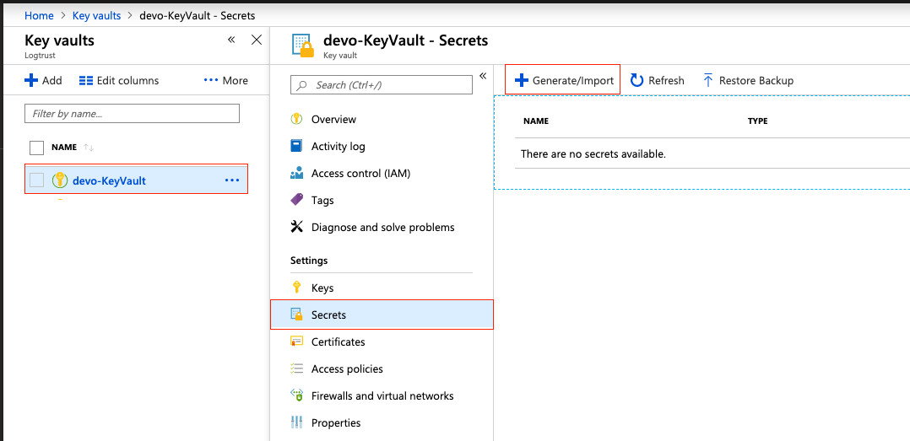

Fill in and select the fields corresponding to your certificates.
You must create one secret for each certificate file (CA, public cert and key cert)

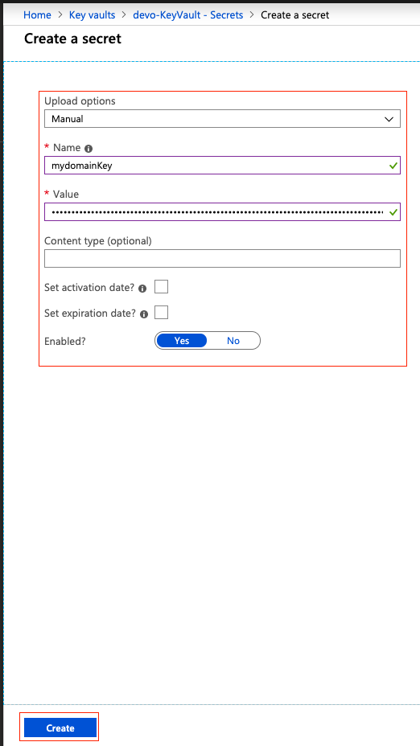

You should have something like the following image

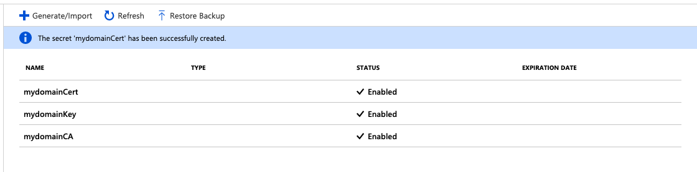

Now, you need to link each secret into Function App. For each secret copy the _Secret Identifier_.

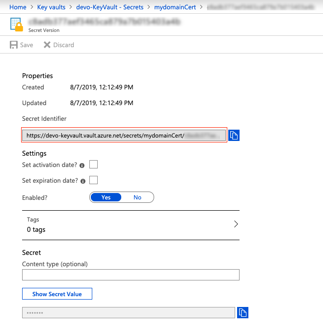

Go to _Configuration_ option in your Function App

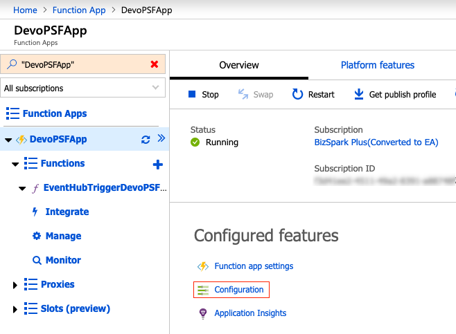

Add a new application setting for each secret.
The name of the application setting must be one of those: _domainCA_, _domainCert_ and _domainKey_ and the value must be like

```
@Microsoft.KeyVault(SecretUri=<kv_secret_identifier>)
```

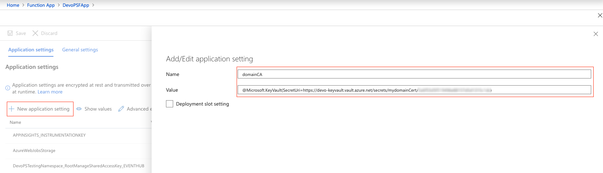

# Enabling Azure function to access Event Hub stream

> :warning: **This step is usually performed by portal when integration with Event Hub for Azure Function is created**: Just here for reference, troubleshooting or manual set up

## Event Hub side

A shared access signature (SAS) provides you with a way to grant limited access to resources in your Event Hubs namespace. SAS guards access to Event Hubs resources based on authorization rules. These rules are configured either on a namespace, or an entity (event hub or topic).

You can review SAS rules at _All services_ -> _Event Hubs_. Then select the Event Hubs namespace you want to give access to:


Inside the Overview screen click on the _Shared access policies_ option in the left side menu:

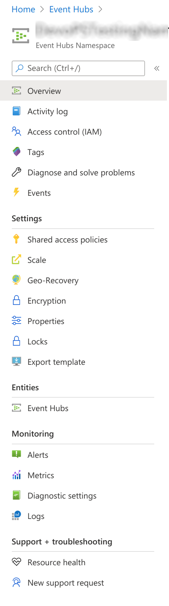

Then you can add a new policy or edit an existent policy:

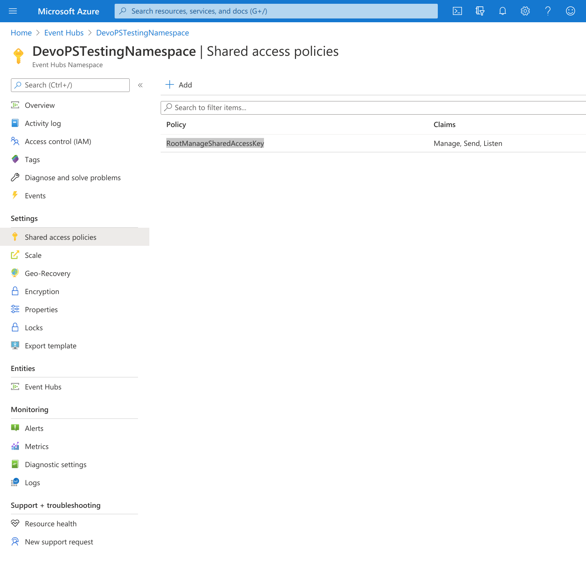

_RootManageSharedAccessKey_ is the default Shared access policy created by default for the namespace, but it has priviledges for all actions (Manage, Send, Listen). We encourage to create a new one with only **Send** priviledges.

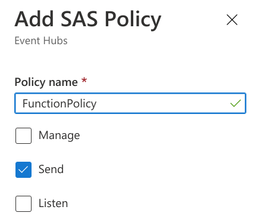

After creating the policy, click on it again to see its details. Copy _Connection string-primary key_ from the right side panel. It would be needed as the value for the applicaction property in the Azure Function.

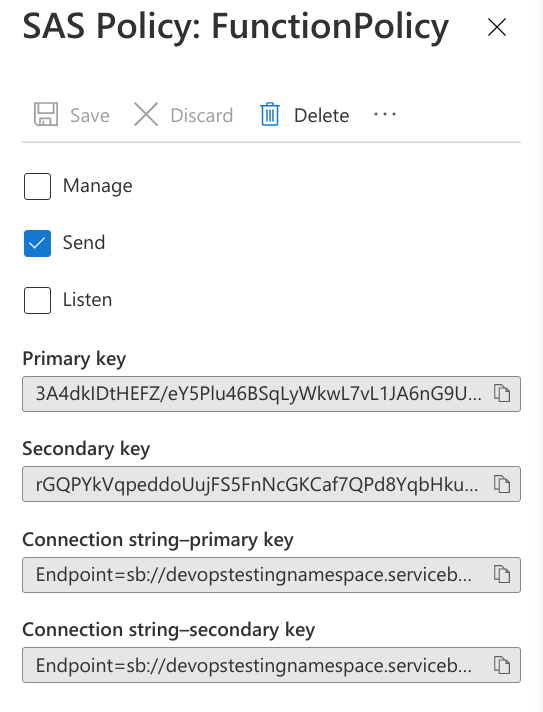

## Azure Function

In order to integrate Event Hub stream in the Azure Function as inbound binding we must configure it at `function.json`:

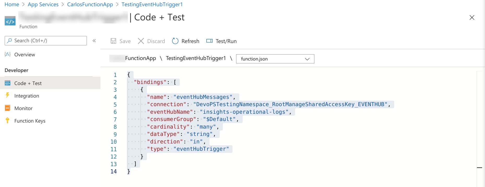

```javascript
{
  "bindings": [
    {
      "name": "eventHubMessages",
      "connection": "DevoPSTestingNamespace_RootManageSharedAccessKey_EVENTHUB",
      "eventHubName": "insights-operational-logs",
      "consumerGroup": "$Default",
      "cardinality": "many",
      "dataType": "string",
      "direction": "in",
      "type": "eventHubTrigger"
    }
  ]
}
```

The `connection` parameter contains as value the key of the application settings pair that contains the value we copied from the last step in former section (_Connection string-primary key_). Therefore, inside Function's _Application settings_ there is an entry whose key is `DevoPSTestingNamespace_RootManageSharedAccessKey_EVENTHUB` that contains the _Connection string-primary key_ to authorize the access to the Event Hub by means of the _Shared access policy_ we have just created.

You can check Function's _Application settings_ at _All services_ -> _App_Services_. Then select the _App Service_ that contains the Azure Function listening for Event Hub events:

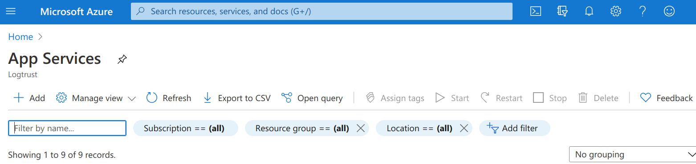

Inside the Overview screen click on the _Configuration_ option under _Settings_ section in the left side menu:

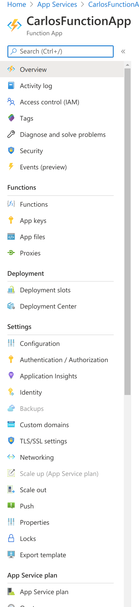

You will find _Applications settings_ tab containing all the key-value settings for the application. There must be a setting whose key is `DevoPSTestingNamespace_RootManageSharedAccessKey_EVENTHUB` or whatever name was used in `function.json`. The vale, hidden by default but it can be disclosed by clicking on it, must contain the _Connection string-primary key_ value we copied from the _Shared access policy_ of the Event Hub namespace.

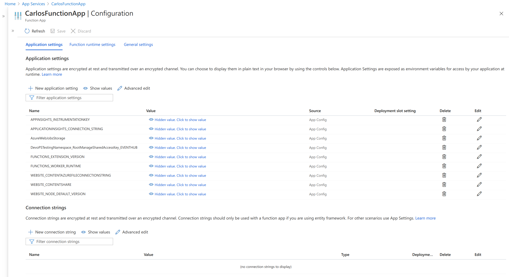

# Sending events from Azure Active Directory

Before to start to retrieve _Audit Logs_ and _Sign-ins_ events from _Azure Active Directory_ you will need to have the permissions necessaries and In order to export Sign-in data, your organization needs Azure AD P1 or P2 license.

Go to _All services_ -> _Azure Active Directory_. Click on the _Audit logs_ or _Sign-ins_ option in the left side menu and then click in _Export Data Settings_.


Turn on diagnostics option


Fill in and select the corresponding values according to requirements and save your configuration.


Now you should start to retrieve events from Azure Active Directory.

# Sending events from Azure Activity Logs

Before to start to retrieve _Activity Logs_ you will need to have the permissions necessaries.

Go to _All services_ -> _Activity log_.

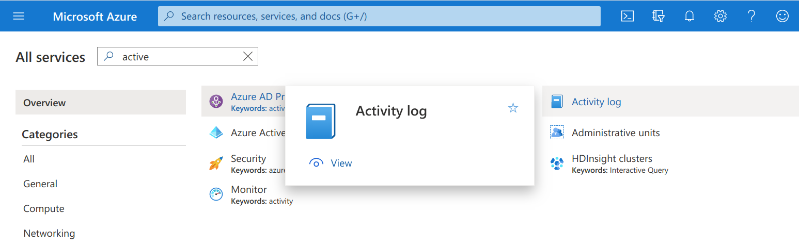

Click on the _Diagnostic settings_ option on the top menu.

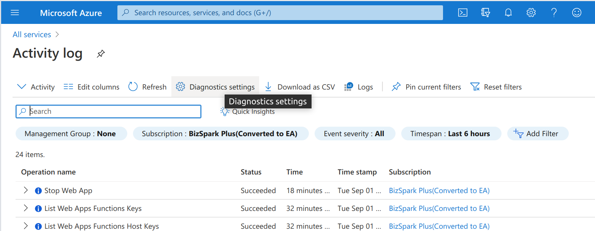

And then edit a existent setting _Edit setting_ or create a new one _+ Add disgnostic setting_.

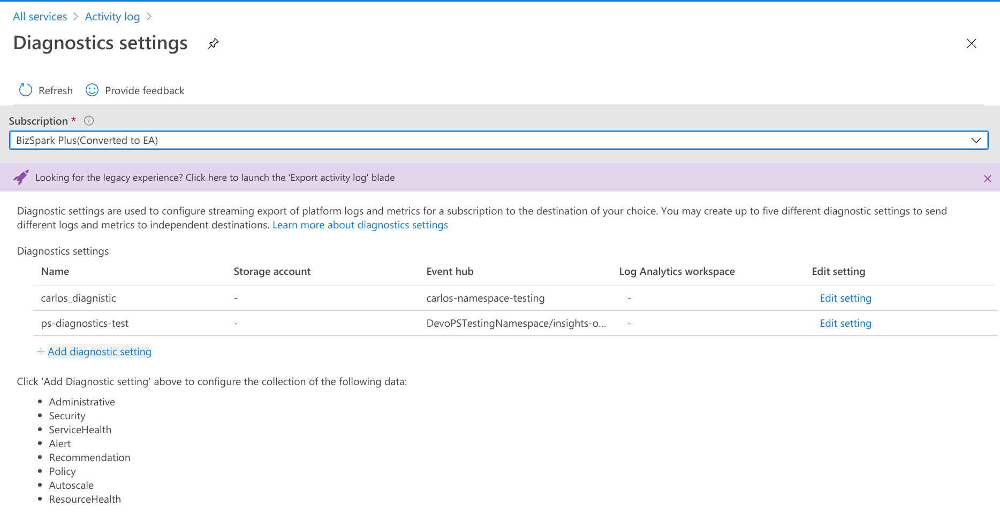

Select the category details to be sent. Select the _Stream to an event hub_ option. Fill in and select the corresponding values according to your Event Hub settings and save your configuration.

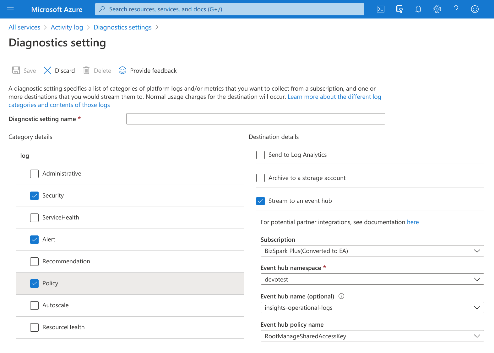

Now you should start to retrieve events from _Activity logs_.

# Links

See how to set up the export of Azure logs to event hub

https://docs.microsoft.com/en-us/azure/monitoring-and-diagnostics/monitoring-stream-activity-logs-event-hubs

Activity Log

https://docs.microsoft.com/en-us/azure/azure-monitor/platform/activity-logs-overview

Audit Log

https://docs.microsoft.com/en-us/azure/active-directory/reports-monitoring/concept-audit-logs

Sing-in logs

https://docs.microsoft.com/en-us/azure/active-directory/reports-monitoring/concept-sign-ins
