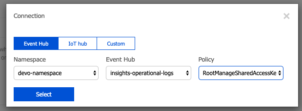

# Creating a Event Hub to send events from Azure to Devo

This is not an agent, but it's a general guide of how to sent events from Azure. 

The _Azure Activity Log_ and _Azure Active Directory_ logs can be easily ingested into the Devo platform by exporting the logs to an Azure event hub, which in turn triggers a cloud function to tag and send the events to Devo. 

You can follow this instructions to send events from an EventHub to Devo platform.
There are two kinds of events that will be sent from Azure to Devo: from Monitor (Azure activities logs) and from Active Directory (Sign-In and Audit logs).

The Azure Activity Log is a subscription log that provides insight into subscription-level events that have occurred in Azure.

Sign-ins logs provides information about the usage of managed applications and user sign-in activities.

Audit logs provides traceability through logs for all changes done by various features within Azure AD. Examples of audit logs include changes made to any resources within Azure AD like adding or removing users, apps, groups, roles and policies.


# Tables

All events from Azure are storage in _cloud.azure_ tech. 
Then, depend on the source of the events, these are saved in custom tables.
The events who comes from Azure Monitor (Azure Activity Log) are store in _cloud.azure.activity_ and from Azure Active Directory are store in _cloud.azure.ad_.

Tag | Azure Operation Type | Description
--- | --- | ---
cloud.azure.ad.audit.<zone> | AuditLogs | The Azure AD audit logs provide records of system activities for compliance.
cloud.azure.ad.signin.<zone> | SignInLogs | The user sign-ins report provides records about activities of AD users.
cloud.azure.activity.delete.<zone> | Delete | Represents the operation type
cloud.azure.activity.events.<zone> | Action | Represents the operation type
cloud.azure.activity.write.<zone> | Write | Represents the operation type

## Prerequisites

- Have a Azure account with the permissions
- Have a Devo account

# Create a EventHub

Go to your Azure portal account and follow the next steps.

## Creating the namespace

- Click on _Create a resource_ on the left side, find and select the _Event Hubs_ resource and click on _Create_ button.


- Fill the fields with the corresponding values. Maybe you will need to create a new _Resource group_ if you haven't.
Click _Create_. This will take few seconds.


- Once the namespace is created you can access to it clicking in _All resources_ on the right side of menu and then in the name space.


## Creating the Event Hubs

- Click on _Monitor_ option on left side menu, then _Activity Log_ and then _Export to Event Hub_ option.


- Select the corresponds options with the susbcription, namespace and regions. Make sure to check _Export to an event hub_ option. 
Then save the changes.


This can take several minutes. Once the event hub is created you can you it in the namespace resource associated.


# Creating the Function App
- Click on _Create a resource_ option on left side menu, then find and select _Function App_ option. Then click _Create_.


- Fill and select the fields corresponding your requirements. Make sure to select _JavaScript_ in _Runtime Stack_ option. 
Click _Create_. This can take several seconds.


- Once that it was created you can check it on _All resources_ option. Select the function app and then click on _*+*_ icon in _Functions_ option.
Choose _In-portal_ option has development enironment, and the click in _Continue_ button.


- Choose _More templates..._ option and then _Finish and view templates_ button.


- Choose the _Azure Event Hub trigger_. It could ask you for install a extension. Install it.


- Fill and select the field according your requirements. In _Event Hub connection_ you will need to select the namespace associated.




- Once the function app was created you should show something like the following image.


In the right side you can see two files and can run the tests. 
In the bottom you can see the console and the logs generated. 
And, in the left side you can see the function app structure.

Now, you need to send all the events to Devo. You will need to upload the credentials of Devo. 
In your computer create a folder with the name _certs_, paste the credential in this folder and compress this folder to _zip_ format.
Then select _upload_ option on the right side and select this zip file. 
Upload the _package.json_ file contained in this tutorial.

The structure of your event hub should looks like the following image


Unzip _certs.zip_ file from the console. 

````bash
> unzip certs.zip
````

You can delete the _zip_ file.

````bash
> rm certs.zip
````

Install the devo js SDK and all dependencies. This will generate a new folder (_node_modules_) with the packages.

```bash
npm install
```

Now, you need to update _index.js_ file according to send the events to Devo from the event hub. 

Copy the _index.js_ file content from this tutorial and paste it in the _index.js_ file of your event hub.

````javascript
const devo = require('@devo/nodejs-sdk');
const fs = require('fs');

module.exports = async function (context, eventHubMessages) {
    context.log(`JavaScript eventhub trigger function called for message array ${eventHubMessages}`);
    let zone = 'eu';
    let senders = {};
    let default_opt = {
        host: "eu.elb.relay.logtrust.net",
        port: 443,
        ca: fs.readFileSync(__dirname+"/certs/chain.crt"),
        cert: fs.readFileSync(__dirname+"/certs/mydomain.crt"),
        key: fs.readFileSync(__dirname+"/certs/mydomain.key")
    };
    let options = {
        'AuditLogs': `cloud.azure.ad.audit.${zone}`,
        'SignInLogs': `cloud.azure.ad.signin.${zone}`,
        'Delete': `cloud.azure.activity.delete.${zone}`,
        'Action': `cloud.azure.activity.events.${zone}`,
        'Write': `cloud.azure.activity.write.${zone}`,
        'default': `my.app.azure.losteventhublogs`
    };
    
    for (let opt in options) {
        let conf = Object.assign({}, default_opt);
        conf['tag'] = options[opt];
        senders[opt] = devo.sender(conf);
    };
    
    eventHubMessages.forEach(message => {
        if (message.constructor !== Object || (message.constructor === Object && !message['records'] )) {
            senders['default'].send(JSON.stringify(message));
        } else {
            for (let m of message.records) {
                if (options[m.category]){
                    senders[m.category].send(m);
                } else {
                    senders['default'].send(m);
                }
                
            }
        }
    });
    
    context.done();    
};
````

Another file is _function.json_. This is a config file generated when you create the function app. 

````json
{
  "bindings": [
    {
      "type": "eventHubTrigger",
      "name": "eventHubMessages",
      "direction": "in",
      "eventHubName": "<eventhubname>",
      "connection": "<connection_var_name_to_spacename>",
      "cardinality": "many",
      "consumerGroup": "$Default"
    }
  ]
}
````

Check that _eventHubName_ and _eventHubName_ attributes corresponds to the values specified in _Integrate_ option of the EventHub.


# Sending events from Active Directory

Before to start to retrieve _Audit Logs_ and _Sign-ins_ events from _Azure Active Directory_ you will need to have the permissions necessaries and In order to export Sign-in data, your organization needs Azure AD P1 or P2 license.

Click on _Audit logs_ or _Sign-ins_ options in the left side menu and then click in _Export Data Settings_.


Turn on diagnostics option


Fill and select the corresponding values according to requirements and save your configuration.


Now you should start to retrieve events from Azure Active Directory.


# Links

See how to set up the export of Azure logs to event hub in the following articles:
https://docs.microsoft.com/en-us/azure/monitoring-and-diagnostics/monitoring-stream-activity-logs-event-hubs

Activity Log
https://docs.microsoft.com/en-us/azure/azure-monitor/platform/activity-logs-overview

Audit Log
https://docs.microsoft.com/en-us/azure/active-directory/reports-monitoring/concept-audit-logs

Sing-in logs
[](https://docs.microsoft.com/en-us/azure/active-directory/reports-monitoring/concept-sign-ins)
