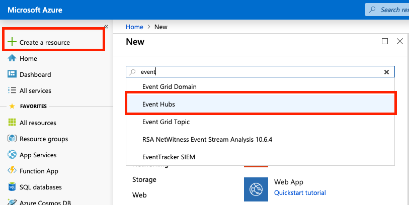

# Creating a Event Hub to send events from Azure to Devo

This is not an agent, but it is a general guide on how to sent events from Azure. 

The _Azure Activity Log_ and _Azure Active Directory_ logs can be easily ingested into the Devo platform by exporting the logs to an Azure event hub, which in turn triggers a cloud function to tag and send the events to Devo. 

You can follow these instructions to send events from an EventHub to the Devo platform.
There are two types of events that could be sent from Azure to Devo: from Monitor (Azure activities logs) and from Active Directory (Sign-In and Audit logs).

The Azure Activity Log is a subscription log that provides insight into subscription-level events that have occurred in Azure.

Sign-ins logs provides information about the usage of managed applications and user sign-in activities.

Audit logs provides traceability through logs for all changes done by various features within Azure AD. Examples of audit logs include changes made to any resources within Azure AD like adding or removing users, apps, groups, roles and policies.


# Tables

All Azure events Azure are storage in _cloud.azure_ tech. 
Then, depending on the source of the events, these are saved in custom tables.
Events that come from Azure Monitor (Azure Activity Log) are store in _cloud.azure.activity.events_ and Azure Active Directory are store in _cloud.azure.ad_.

Tag | Azure Operation Type | Description
--- | --- | ---
cloud.azure.ad.audit.\<zone> | AuditLogs | The Azure AD audit logs provide records of system activities for compliance.
cloud.azure.ad.signin.\<zone> | SignInLogs | The user sign-ins report provides records about activities of AD users.
cloud.azure.activity.events.\<zone> | Activity logs | Azure Activity logs (Action, Write, Delete)

## Prerequisites

- Have a Azure account with the permissions
- Have a Devo account

# Create a EventHub

Go to your Azure portal account and follow the steps below.

### Creating the namespace

Click _Create a resource_ on the left side, find and select the _Event Hubs_ resource and click on the _Create_ button.



Fill the fields with the corresponding values. You may need to create a new _Resource group_ if you have not already done so.
Click on _Create_. This will take a few seconds.


Once the namespace is created, you can access it by clicking on _All resources_ on the right side of the menu and then on the namespace.


## Creating the Event Hubs

Click on the _Monitor_ option in the left side menu, then on _Activity Log_ and then on the _Export to Event Hub_ option.


Select the corresponding options with the susbcription, the namespace and the regions. Be sure to check _Export to an event hub_ option. 
Then save the changes.


This may take several minutes. Once the event hub is created you can see it in the associated namespace resource.


# Creating the Function App

Click on _Create a resource_ option in left-hand menu, then search and select the _Function App_ option. 
Then click on _Create_.


Fill in and select the fields corresponding your requirements. Make sure to select _JavaScript_ in the _Runtime Stack_ option. 
Click on _Create_. This may take several seconds.


Once that it was created you can check it in _All resources_ option. 
Select the function app and then click on _*+*_ icon in the _Functions_ option.
Choose the _In-portal_ option as the development environment, and then click on the _Continue_ button.


Choose the _More templates..._ option and then click on the _Finish and view templates_ button.


Choose the _Azure Event Hub trigger_. This could ask you to install an extension. Install it.


Fill in and select the fields according your requirements. 
In the _Event Hub connection_ you must select the associated namespace.


Once the function app has been created, something like the following image should be displayed.


On the right side you can see two files and the option "Test".
In the lower part you can see the console and the generated logs.
And, on the left side, you can see the structure of the function app.

Now, you need to send the events to Devo. 
First, you must upload the credentials of the Devo domain.
On your computer, create a folder with the name _certs_, paste the credentials here and then compress this folder in _zip_ format.
Then, select the _upload_ option on the right side and select the newly created zip file.
It also uploads the _package.json_ file contained in this tutorial.

The structure of your event hub function app should look like the following image


Unzip the _certs.zip_ file from the console. 

````bash
> unzip certs.zip
````

Delete the _zip_ file.

````bash
> rm certs.zip
````

Install the devo js SDK and all dependencies. This will generate a new folder (_node_modules_) with the packages.

```bash
npm install
```

Now, you need to update the _index.js_ file to send the events to Devo from the event hub. 

Copy teh contents of the _index.js_ from this tutorial and paste it into the _index.js_ file of your event hub.

````javascript
const devo = require('@devo/nodejs-sdk');
const fs = require('fs');

module.exports = async function (context, eventHubMessages) {
    context.log(`JavaScript eventhub trigger function called for message array ${eventHubMessages}`);
    let zone = 'eu';
    let senders = {};
    let default_opt = {
        host: "eu.elb.relay.logtrust.net",
        port: 443,
        ca: fs.readFileSync(__dirname+"/certs/chain.crt"),
        cert: fs.readFileSync(__dirname+"/certs/mydomain.crt"),
        key: fs.readFileSync(__dirname+"/certs/mydomain.key")
    };
    let options = {
        'AuditLogs': `cloud.azure.ad.audit.${zone}`,
        'SignInLogs': `cloud.azure.ad.signin.${zone}`,
        'Delete': `cloud.azure.activity.events.${zone}`,
        'Action': `cloud.azure.activity.events.${zone}`,
        'Write': `cloud.azure.activity.events.${zone}`,
        'default': `my.app.azure.losteventhublogs`
    };
    
    for (let opt in options) {
        let conf = Object.assign({}, default_opt);
        conf['tag'] = options[opt];
        senders[opt] = devo.sender(conf);
    };
    
    eventHubMessages.forEach(message => {
        if (message.constructor !== Object || (message.constructor === Object && !message['records'] )) {
            senders['default'].send(JSON.stringify(message));
        } else {
            for (let m of message.records) {
                if (options[m.category]){
                    senders[m.category].send(m);
                } else {
                    senders['default'].send(m);
                }
                
            }
        }
    });
    
    context.done();    
};
````

Another important file is the _function.json_. This is a config file generated when you created the function app. 

````json
{
  "bindings": [
    {
      "type": "eventHubTrigger",
      "name": "eventHubMessages",
      "direction": "in",
      "eventHubName": "<eventhubname>",
      "connection": "<connection_var_name_to_spacename>",
      "cardinality": "many",
      "consumerGroup": "$Default"
    }
  ]
}
````

Verify that the _eventHubName_ and _eventHubName_ corresponds to the values specified in the _Integrate_ option of the EventHub.


# Sending events from Azure Active Directory

Before to start to retrieve _Audit Logs_ and _Sign-ins_ events from _Azure Active Directory_ you will need to have the permissions necessaries and In order to export Sign-in data, your organization needs Azure AD P1 or P2 license.

Click on the _Audit logs_ or _Sign-ins_ option in the left side menu and then click in _Export Data Settings_.


Turn on diagnostics option


Fill in and select the corresponding values according to requirements and save your configuration.


Now you should start to retrieve events from Azure Active Directory.

# Links

See how to set up the export of Azure logs to event hub

https://docs.microsoft.com/en-us/azure/monitoring-and-diagnostics/monitoring-stream-activity-logs-event-hubs

Activity Log

https://docs.microsoft.com/en-us/azure/azure-monitor/platform/activity-logs-overview

Audit Log

https://docs.microsoft.com/en-us/azure/active-directory/reports-monitoring/concept-audit-logs

Sing-in logs

https://docs.microsoft.com/en-us/azure/active-directory/reports-monitoring/concept-sign-ins
